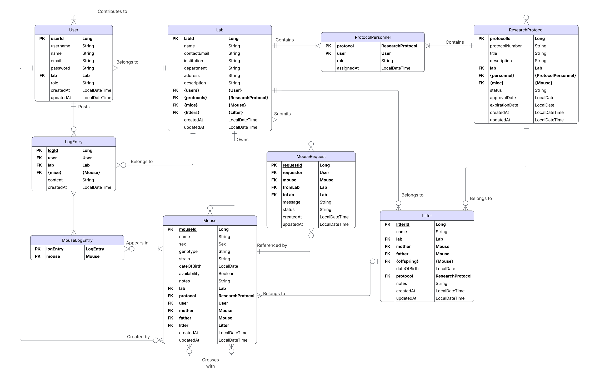

# Mouse Colony Management API

> Mastering the fundamentals of REST API development in Java using Spring Boot

A comprehensive Spring Boot application for managing laboratory mouse colonies and facilitating mouse sharing across research groups within a research institute.

## Table of Contents

- [Project Overview](#project-overview)
- [Current Status](#current-status)
- [Features](#features)
- [Database Schema](#database-schema)
- [Technologies Used](#technologies-used)
- [Prerequisites](#prerequisites)
- [Getting Started](#getting-started)
- [API Structure](#api-structure)
- [Future Enhancements](#future-enhancements)

## Project Overview

This application provides a RESTful API for managing mouse colonies in a research laboratory environment. It enables researchers to track mouse lineages, manage breeding programs, coordinate research protocols, and share mice between different labs within an institution.

### Key Capabilities

- **Mouse Management**: Track individual mice with detailed genetic and breeding information
- **Litter Tracking**: Organize and monitor breeding pairs and their offspring
- **Laboratory Organization**: Manage multiple labs within an institution
- **Protocol Management**: Associate mice with specific research protocols and personnel
- **Mouse Sharing**: Request and transfer mice between labs
- **Activity Logging**: Maintain detailed logs of all colony activities

## Current Status

The project currently implements the **service layer** with full CRUD operations and business logic for all entities. This includes:

**Completed**:
- Entity models with JPA annotations
- Service layer with business logic
- Repository interfaces
- Database schema design
- Flyway migrations setup

**In Progress**:
- REST controllers
- API endpoints
- Request/Response DTOs
- Input validation

**Planned**:
- Authentication & authorization
- API documentation (Swagger/OpenAPI)
- Unit and integration tests
- Docker containerization

## Features

### Entity Management

- **Lab**: Institution, department, and contact information
- **User**: Lab members with roles and permissions
- **Mouse**: Individual mice with genetic, breeding, and availability data
- **Litter**: Breeding pairs and their offspring
- **Research Protocol**: IACUC protocols with personnel assignments
- **Mouse Request**: Inter-lab mouse transfer requests
- **Log Entry**: Activity logs with mouse associations

### Business Logic

- Automated timestamp management (creation and updates)
- Parent-child relationships for mice
- Litter-based mouse creation
- Mouse availability tracking
- Inter-lab transfer workflows
- Protocol personnel management
- Searchable log entries with keyword filtering

## Database Schema

The application uses a relational database with the following entity relationships:



### Core Entities

```
Lab → Users, Mice, Litters, Protocols
Mouse → Lab, Protocol, User, Mother, Father, Litter
Litter → Lab, Mother, Father, Protocol, Offspring
ResearchProtocol → Lab, Mice, Personnel
User → Lab
MouseRequest → Requestor, Mouse, FromLab, ToLab
LogEntry → User, Lab, Mice
```

### Join Tables

- **ProtocolPersonnel**: Links users to research protocols with roles
- **MouseLogEntry**: Associates mice with log entries (many-to-many)

## Technologies Used

### Core Framework
- **Spring Boot 3.5.6**: Application framework
- **Java 21**: Programming language
- **Maven**: Build and dependency management

### Spring Modules
- **Spring Boot Starter Web**: RESTful web services
- **Spring Boot Starter Data JPA**: Database persistence
- **Spring Boot DevTools**: Development utilities with auto-reload

### Database
- **MySQL**: Relational database
- **Flyway**: Database migrations and versioning
- **Hibernate**: ORM (via Spring Data JPA)

### Development Tools
- **Lombok**: Boilerplate code reduction
    - `@Getter`, `@Setter`: Automatic getters/setters
    - `@Builder`: Builder pattern implementation
    - `@AllArgsConstructor`, `@NoArgsConstructor`: Constructor generation

### Testing
- **Spring Boot Starter Test**: Testing framework (JUnit, Mockito, etc.)

## Prerequisites

- **Java**: JDK 21 or higher
- **Maven**: 3.6+ (or use Maven Wrapper included)
- **MySQL**: 8.0+ database server
- **IDE**: IntelliJ IDEA, Eclipse, or VS Code with Java extensions

## Getting Started

### 1. Clone the Repository

```bash
git clone https://github.com/davidfrivas/spring-boot-fundamentals.git
cd mouse-colony-app
```

### 2. Configure Database

Create a `src/main/resources/application.properties` file:

```properties
# Database Configuration
spring.datasource.url=jdbc:mysql://localhost:3306/mouse_colony_app?createDatabaseIfNotExist=true
spring.datasource.username=${DB_USER}
spring.datasource.password=${DB_PASSWORD}
spring.jpa.hibernate.ddl-auto=validate
spring.jpa.show-sql=true

# Flyway Configuration
spring.flyway.enabled=true
spring.flyway.baseline-on-migrate=true
```

Set environment variables:

```bash
export DB_USER=your_username
export DB_PASSWORD=your_password
```

### 3. Run Flyway Migrations

```bash
mvn flyway:migrate
```

### 4. Build the Project

```bash
mvn clean install
```

### 5. Run the Application

```bash
mvn spring-boot:run
```

The application will start on `http://localhost:8080`.

## API Structure

```
com.davidfrivas.mouse_colony_app/
├── docs/
│   └── er-diagram.pdf
├── entities/          # JPA entity classes
│   ├── Lab.java
│   ├── User.java
│   ├── Mouse.java
│   ├── Litter.java
│   ├── ResearchProtocol.java
│   ├── ProtocolPersonnel.java
│   ├── MouseRequest.java
│   ├── LogEntry.java
│   └── MouseLogEntry.java
├── repositories/      # Spring Data JPA repositories
├── services/          # Business logic layer
│   ├── LabService.java
│   ├── UserService.java
│   ├── MouseService.java
│   ├── LitterService.java
│   ├── ResearchProtocolService.java
│   ├── MouseRequestService.java
│   └── LogEntryService.java
└── controllers/       # REST API endpoints (in progress)
```

## Future Enhancements

### Short Term
- [ ] Complete REST controller implementation
- [ ] Add comprehensive input validation
- [ ] Implement DTO layer for API requests/responses
- [ ] Add Swagger/OpenAPI documentation
- [ ] Implement pagination for list endpoints

### Medium Term
- [ ] Add Spring Security for authentication
- [ ] Implement role-based access control (RBAC)
- [ ] Add email notifications for mouse requests
- [ ] Create audit trail for sensitive operations
- [ ] Implement file upload for protocol documents

### Long Term
- [ ] Build frontend application (React/Angular)
- [ ] Add GraphQL API option
- [ ] Implement real-time notifications (WebSocket)
- [ ] Add analytics and reporting features
- [ ] Create mobile application

## License

This project is part of a learning initiative focused on mastering REST API development with Spring Boot.

## Author

**David Rivas**

---

**Note**: This project is under active development. The service layer is complete, and REST controllers are being implemented. Contributions and feedback are welcome!